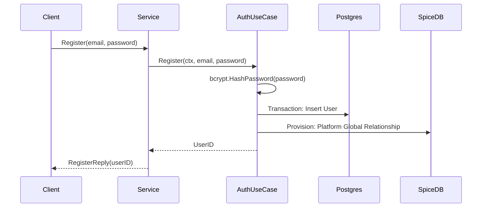
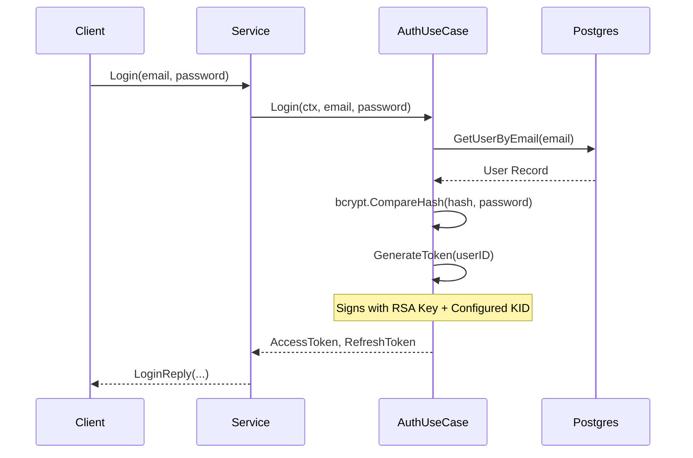
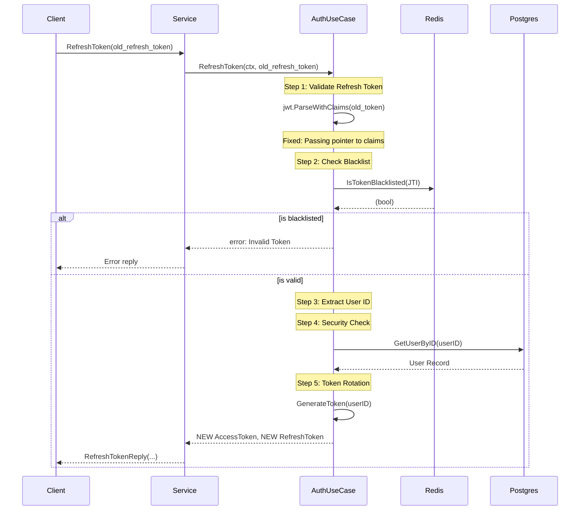
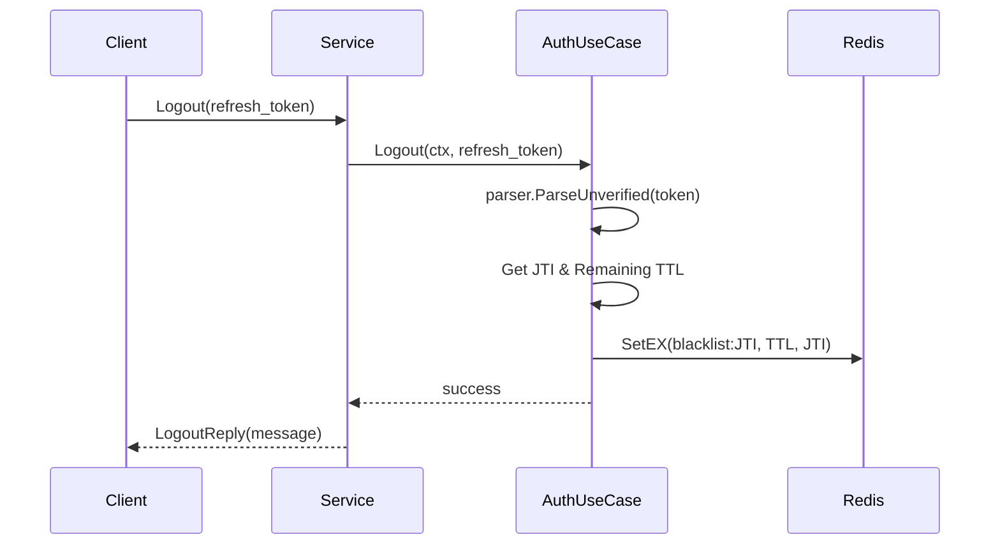

# Auth Storage Service: Sequence Flows

This document details the core authentication and authorization flows between the Client, AuthService, Biz layer, and external storage systems.

## 1. User Registration
Handles user creation in the database and initial provisioning in SpiceDB.

## 2. User Login
Authenticates user credentials and generates Initial JWT pairs.

## 3. Token Refresh (with Rotation)
Validates old refresh token, checks blacklist, and provides a completely new pair.

## 4. User Logout (Blacklisting)
Invalidates a refresh token by adding its ID to Redis.

