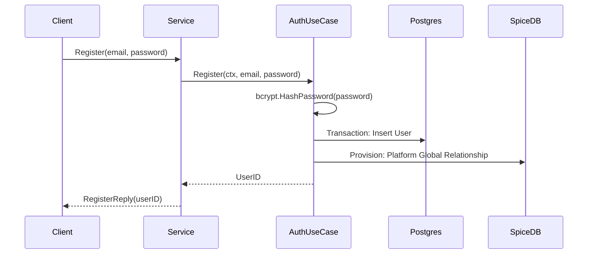
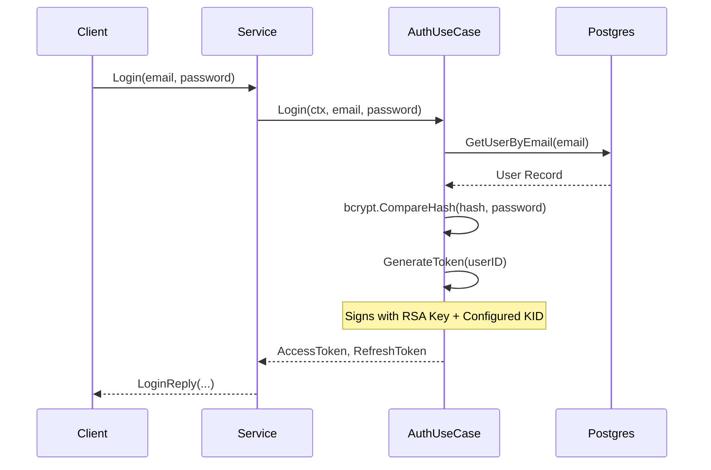
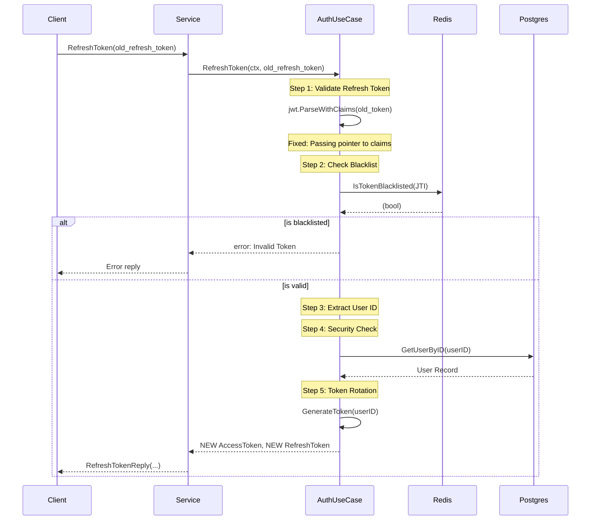
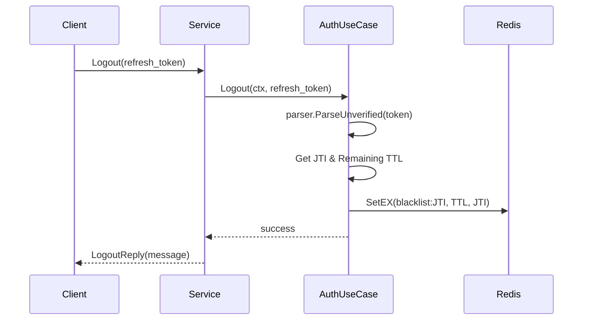
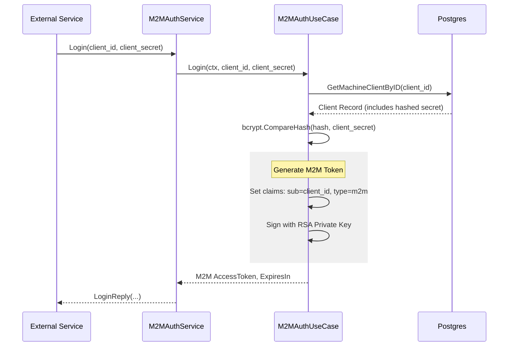

# Auth Storage Service: Sequence Flows

This document details the core authentication and authorization flows between the Client, AuthService, Biz layer, and external storage systems.

## 1. User Registration
Handles user creation in the database and initial provisioning in SpiceDB.

## 2. User Login
Authenticates user credentials and generates Initial JWT pairs.

## 3. Token Refresh (with Rotation)
Validates old refresh token, checks blacklist, and provides a completely new pair.

## 4. User Logout (Blacklisting)
Invalidates a refresh token by adding its ID to Redis.

## 5. Machine-to-Machine (M2M) Login
Authenticates microservices or automated clients using static IDs and secrets.

## 6. Business Operations & API Ordering

This section describes the order in which internal and external APIs must be called to ensure data and permission consistency.

### 6.1 Creating a Standard Folder
When a user creates a new top-level folder.

1.  **App Logic**: Generate a new UUID for the folder.
2.  **App Logic**: Insert the folder record into the SQL database.
3.  **Auth Call**: `Permission.WriteRelationship`
    *   `resource_type`: `"folder"`
    *   `resource_id`: `[folder_uuid]`
    *   `relation`: `"owner"`
    *   `subject_type`: `"user"`
    *   `subject_id`: `[user_id]`

### 6.2 Creating a Folder in a Shared Directory
When a user creates a folder inside another folder that has its own permissions.

1.  **App Logic**: Generate a new UUID for the folder.
2.  **App Logic**: Insert the folder record into the SQL database (linked to parent).
3.  **Auth Call (Owner)**: `Permission.WriteRelationship`
    *   `relation`: `"owner"`, `subject_type`: `"user"`, `subject_id`: `[user_id]`
4.  **Auth Call (Inheritance)**: `Permission.WriteRelationship`
    *   `resource_type`: `"folder"`
    *   `resource_id`: `[new_folder_uuid]`
    *   `relation`: `"parent"`
    *   `subject_type`: `"folder"`
    *   `subject_id`: `[parent_folder_uuid]`
    *   *Note: This ensures parent permissions flow down to the new child.*

### 6.3 Verifying Access before Action
Before allowing a user to read or modify a file/folder.

1.  **Auth Call**: `Permission.CheckPermission`
    *   `resource_type`: `"folder"`
    *   `resource_id`: `[target_id]`
    *   `relation`: `"read"` (or `"write"` / `"delete"`)
    *   `subject_type`: `"user"`
    *   `subject_id`: `[user_id]`
2.  **App Logic**: Proceed with the database operation ONLY if `Allowed: true`.

